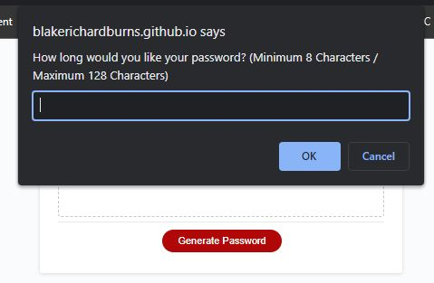

# Password Generator
Module 3 Challenge: JavaScript

## Live Link
https://blakerichardburns.github.io/password-generator/

## Repository Link
https://github.com/blakerichardburns/password-generator

## Description
Code refactor to add interactive functionality to a random password generator.

  ## Table of Contents
  * [Installation Instructions](#installation-instructions)
  * [Usage Information](#usage-information)
  * [Questions](#questions)

  ## Installation Instructions
  N/A

  ## Usage Information
  N/A 
  
  ## Questions
  For any inquiries, spam by inbox here: blakerichardburns@gmail.com
  To peruse more of my portfolio, check this out: [blakerichardburns](https://github.com/blakerichardburns)